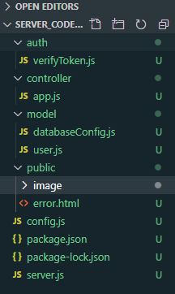

# Problems with this backend server

## 1. File structure  

### 1. `auth` folder

Image of the file structure:  

  

So the first problem here is that the `auth` folder at the top is not too descriptive, it does not convey the information of how the code in the folder is used, i.e. as a middleware.  
As well as this, the folder makes it seems as though there are more files used for authenticating a user when there is really only one.  

It would be much better to have a `middleware` or `customMiddleware` folder to store this file.  
If there were also more file used to authenticate someone, a folder with `auth` could be inside the `middleware` folder.  

### 2. `app.js` and `server.js`

For this example, it is not immediately obvious what the difference is between these 2 files.  
One could assume that in the case where you have multiple apps hosted on 1 server, or in this case, it was most likely to work around the `app.js` file being in a sub dir and not having access to other sub dirs of the folder easily.  
There is also the downside of moving the controller APIs code into the root dir which is not what we want, but there is another reason why this won't be a problem, which we will touch on later.

Therefore, there really is no downside in moving the `app.js` code into the `server.js` file, as this code should be in the root dir of the project anyway.  

